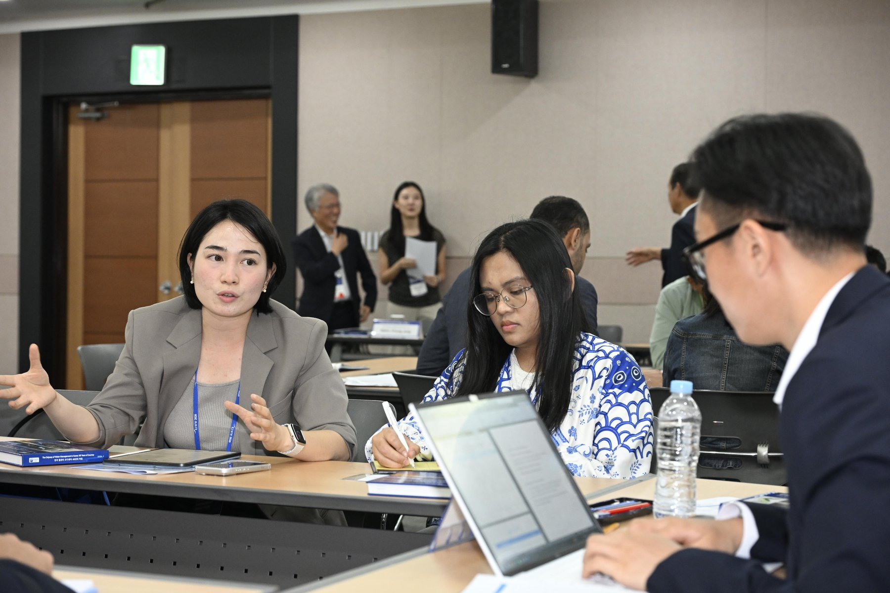
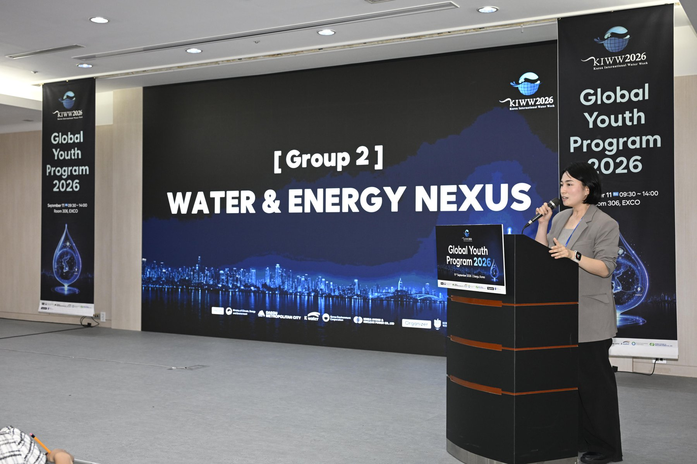
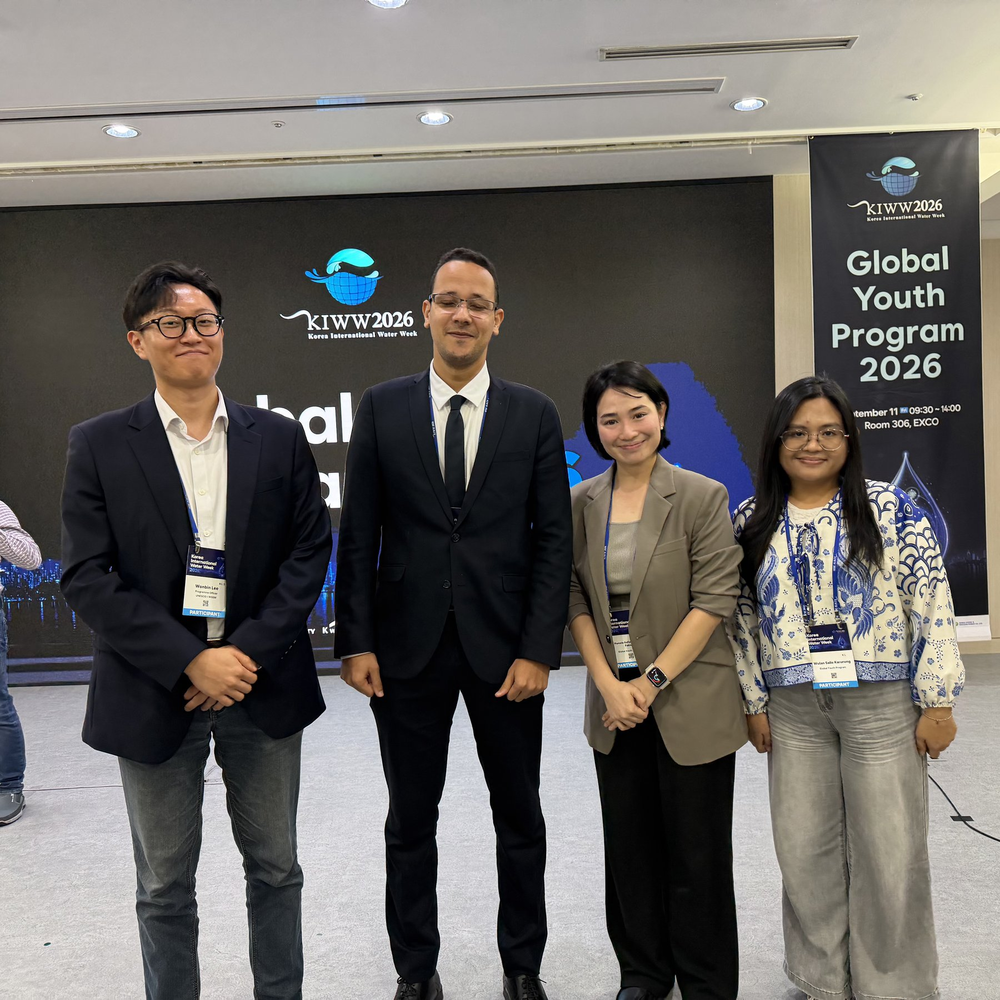
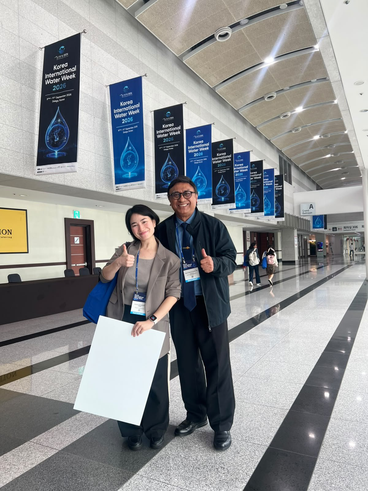
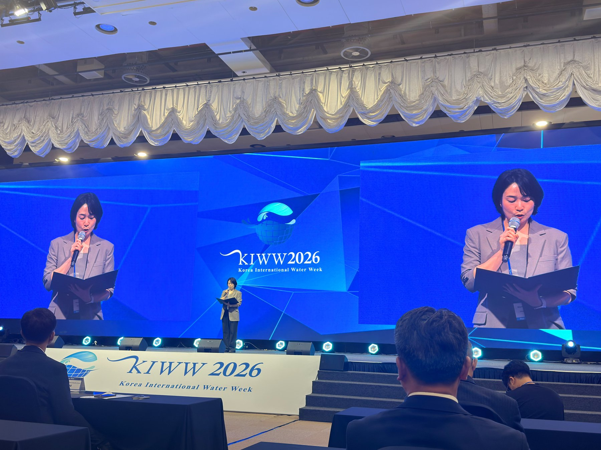

```{=html}
<nav>
  <div class="nav-inner">
    <a class="nav-name" href="../index.html">Sofia Fabian</a>
    <ul class="nav-links">
      <li><a href="../blog.html">← Blog</a></li>
    </ul>
  </div>
</nav>

<div class="post-wrap">

  <a class="post-back" href="../blog.html">← Blog</a>

  <div class="event-details">
    <strong>Korea International Water Week 2026: Global Youth Program</strong><br>
    "Water, Energy, AI: Securing Our Future"<br>
    September 11, 2026; EXCO, Daegu, Korea
  </div>

  <p class="post-body">On September 11, 2026, I joined the Global Youth Program at Korea International Water Week, alongside young people from different countries, disciplines and careers. We worked through five themes shaping our shared water future: climate action, the water–energy nexus, AI and water management, water diplomacy, and SDG 6 and development cooperation.</p>

  <div class="photo-pair">
    
    
  </div>

  <p class="post-body">I worked in the Water–Energy Nexus group with Moustafa from Egypt, Wulan from Indonesia, and our facilitator Wonbin from Korea. I brought a hot topic from my country, The Philippines, the proposed Pax Silica hub, and the water and energy questions it raises. Together we proposed water–energy nexus indicators to compare how efficiently new infrastructure, cities and countries use both. We also called for integrated water–energy frameworks that weigh the trade-offs of industrial development, from AI to desalination to renewable energy. Our recommendations became part of the Global Youth Declaration, presented at the KIWW closing ceremony.</p>

  <p class="post-body">I'm deeply honoured to have received an award, and grateful for the chance to represent and share our declaration.</p>

  <div class="photo-grid">
    
    
    
  </div>

  <p class="post-body">I also met wonderful people from the other groups: Bright, Lorraine, Asri, Sir Dharma Putra, and many more. Truly a core memory.</p>

  <p class="post-credits">Photos: KIWW 2026 photographers</p>

</div>

<footer>
  <div class="footer-inner">
    <div class="footer-name">Sofia Fabian</div>
    <div class="footer-copy">© 2026 Sofia Fabian</div>
  </div>
</footer>
```
