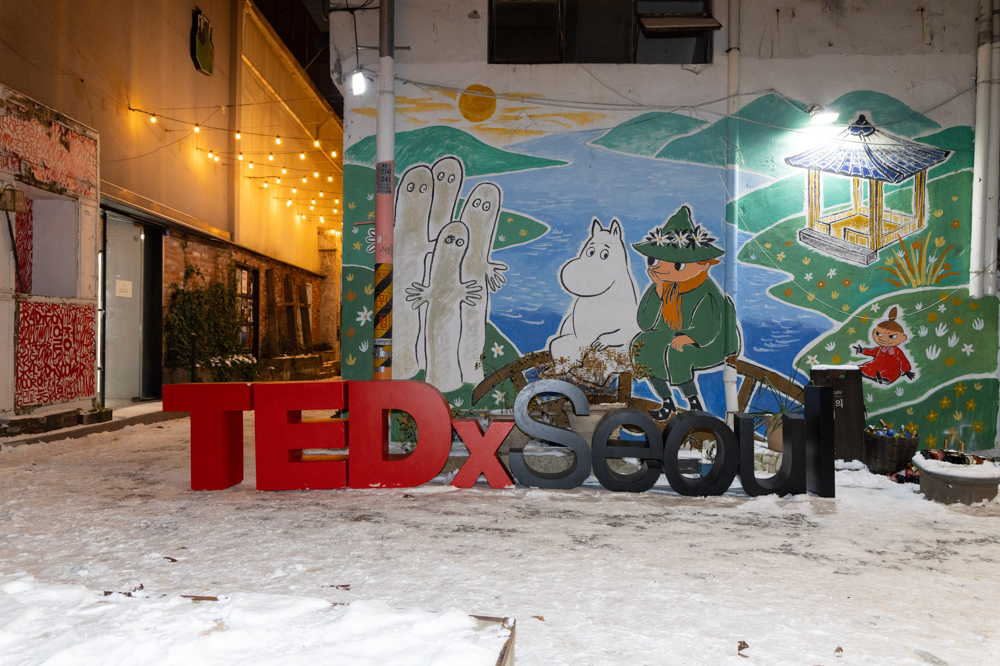
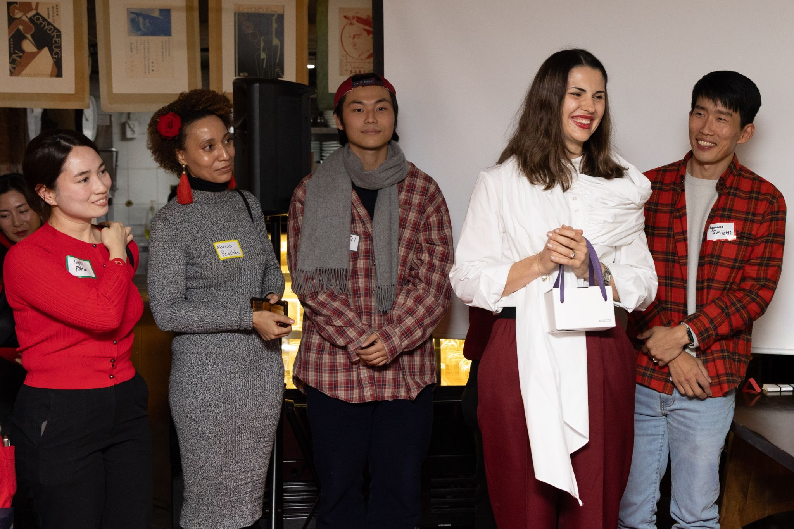
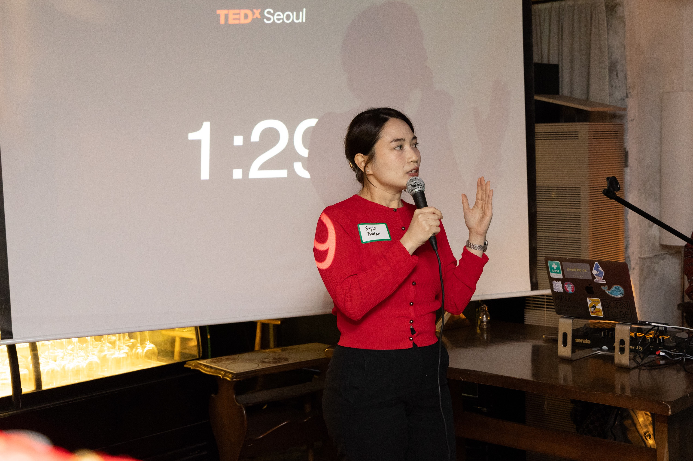
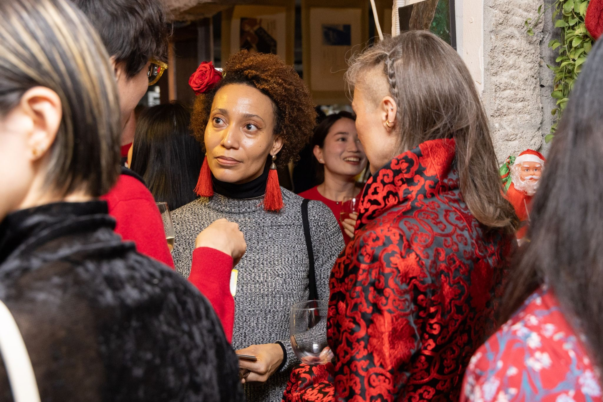
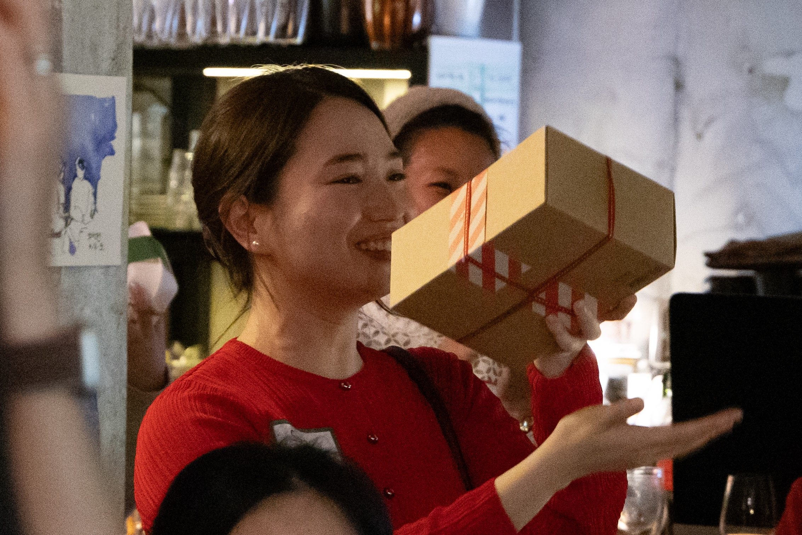

```{=html}
<nav>
  <div class="nav-inner">
    <a class="nav-name" href="../index.html">Sofia Fabian</a>
    <ul class="nav-links">
      <li><a href="../blog.html">← Blog</a></li>
    </ul>
  </div>
</nav>

<div class="post-wrap">

  <a class="post-back" href="../blog.html">← Blog</a>

  <div class="event-details">
    TEDxSeoul Year-End Gathering 2025 'The Story Continues'<br>
    December 5, 2026; Joseon Salon KOTE, Insadong
  </div>

  <div class="photo-pair">
    
    
  </div>

  <p class="post-body">On December 5, 2025, I gave a talk at TEDxSeoul on why climate science might be asking the wrong questions, and what happens when we replace crisis framing with imagination. It was the beginning of a line of thinking I'm still developing. Climaginative grew out of it.</p>

  <div class="photo-grid">
    
    
    
  </div>

  <p class="post-credits">Photos: TEDxSeoul Photographer</p>

</div>

<footer>
  <div class="footer-inner">
    <div class="footer-name">Sofia Fabian</div>
    <div class="footer-copy">© 2026 Sofia Fabian</div>
  </div>
</footer>
```
